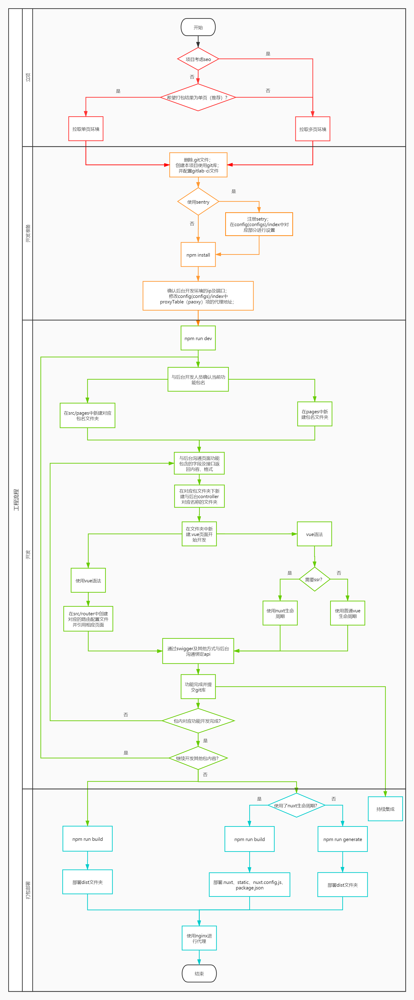

# porcupine 前端工程化

我能提供的前端工程化解决方案

[文档地址](https://beiding110.github.io/por-fee-doc/#/)

## 快速开始

<table>
	<tr>
	    <th>阶段</th>
	    <th>功能</th>
	    <th>技术选型</th>  
	</tr>
	<tr>
	    <td rowspan="3">架构和骨架</td>
	    <td>框架选型</td>
	    <td>Vue</td>
	</tr>
	<tr>
	    <td>依赖管理</td>
	    <td>npm</td>
	</tr>
    <tr>
	    <td>脚手架</td>
	    <td>vue-cli、nuxt</td>
	</tr>
    <tr>
	    <td rowspan="4">业务开发</td>
	    <td>模块化</td>
	    <td>UMD:Webpack</td>
	</tr>
	<tr>
	    <td>源码管理</td>
	    <td>GitLab</td>
	</tr>
	<tr>
	    <td>编码规范</td>
	    <td>ESLint</td>
	</tr>
	<tr>
	    <td>自动格式化</td>
	    <td>vetur、prettier</td>
	</tr>
    <tr>
	    <td>构建</td>
	    <td>预编译</td>
	    <td>SASS、Webpack、Babel</td>  
	</tr>
    <tr>
	    <td>部署</td>
	    <td>方法论</td>
	    <td>GitLab-ci</td>  
	</tr>
    <tr>
	    <td rowspan="2">监控</td>
	    <td>错误收集</td>
	    <td>Sentry</td>
	</tr>
	<tr>
	    <td>业务指标</td>
	    <td>CNZZ</td>
	</tr>
</table>

## 开发流程引导

如果不确定开发时的工作顺序，可以 `参考` 本流程

