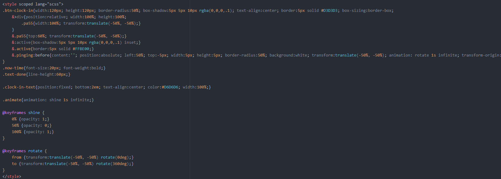
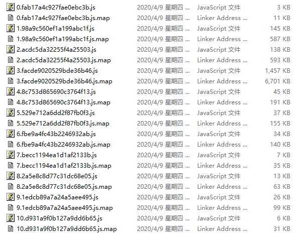

## 预编译

### 选用技术

[SASS](https://www.sass.hk/)

### 说明

使开发人员编写css代码时能够使用编程格式进行书写，并在编译后生成标准css样式；

### 选用技术

[webpack](https://www.webpackjs.com/)

### 说明

能够将 `模块化` 引用的代码进行 `引用、合并、压缩等` 操作，最终生成 `用于生产环境` 的代码集合；

生成的文件可以挂hash值，用于清理缓存；

### 选用技术

[Babel](https://www.babeljs.cn/)

### 说明

使开发人员能够使用 `js-es6或更高版本` 的语法进行编程，编译后自动解析为 `js-es5` 的代码，主要用于 `兼容ie`；
