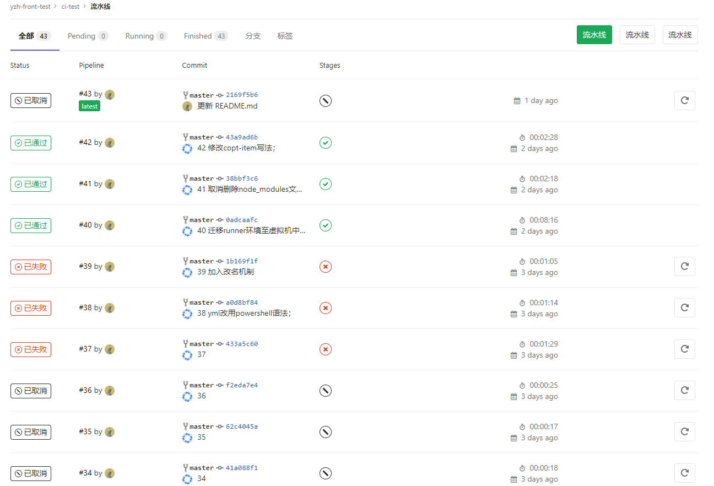
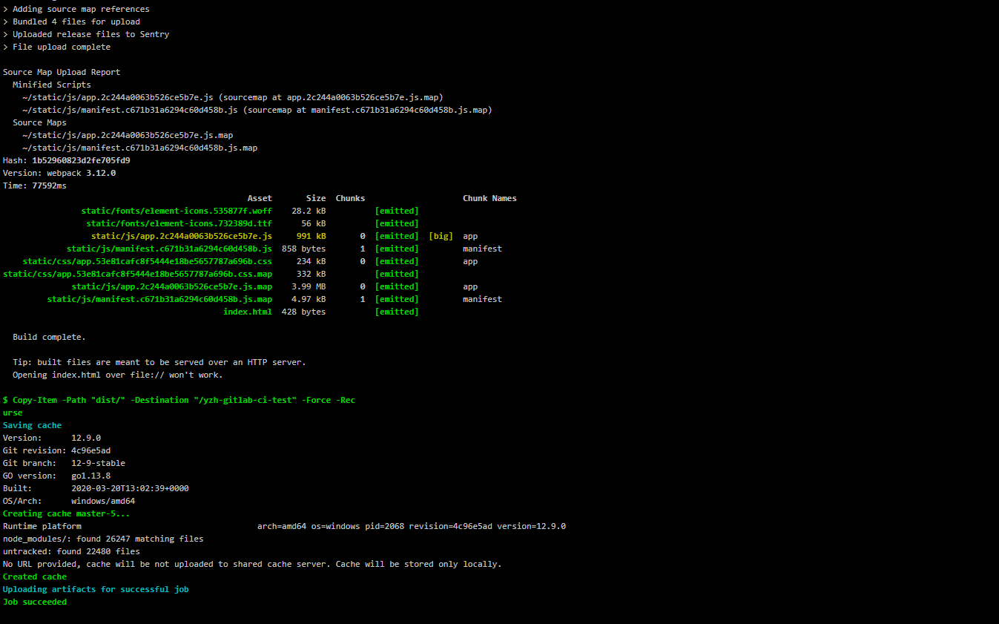
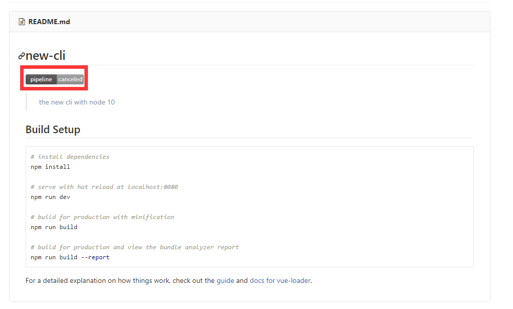

## 方法论（持续集成）

### 选用技术

[GitLab-ci](https://docs.gitlab.com/ee/ci/README.html)

### 说明

代码进行提交后，会自动激活到 `分支对应` 的服务，进行预先设定好的功能（单元测试、编译、部署等）；

保证 `生产环境` 与 `对应分支` 内代码一致；降低人工成本；自动完成基础单元测试；

具体代码可参考 [ci-test](https://github.com/beiding110/ci-test) ;







```.gitlab-ci.yml

before_script:
  - chcp 65001
stages:
  - build
build:
  stage: build
  script:
    - Copy-Item -Path "*" -Destination "/tdzpg-zl/gitlib/tdzpg-model" -Force -Recurse
    - cd \tdzpg-zl\gitlib\tdzpg-model
    - mvn clean install
    - cd \tdzpg-zl\gitlib\td-zpg-sys
    - mvn clean install
    - Copy-Item -Path "target/sys.war" -Destination "/tdzpg-zl/apache-tomcat-9.0.0.M27/webapps" -Force -Recurse
    - cd /tdzpg-zl/apache-tomcat-9.0.0.M27/bin
    - start shutdown.bat
    - cd /tdzpg-zl/apache-tomcat-9.0.0.M27/webapps
    - Start-Sleep -Seconds 2
    - Remove-Item -Path "sys" -Force -Recurse
    - cd /tdzpg-zl/apache-tomcat-9.0.0.M27/bin
    - start startup.bat
  only:
    - master
  tags:
    - tdzpg-model

```
