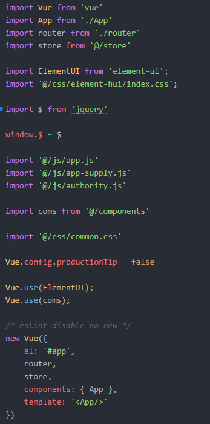
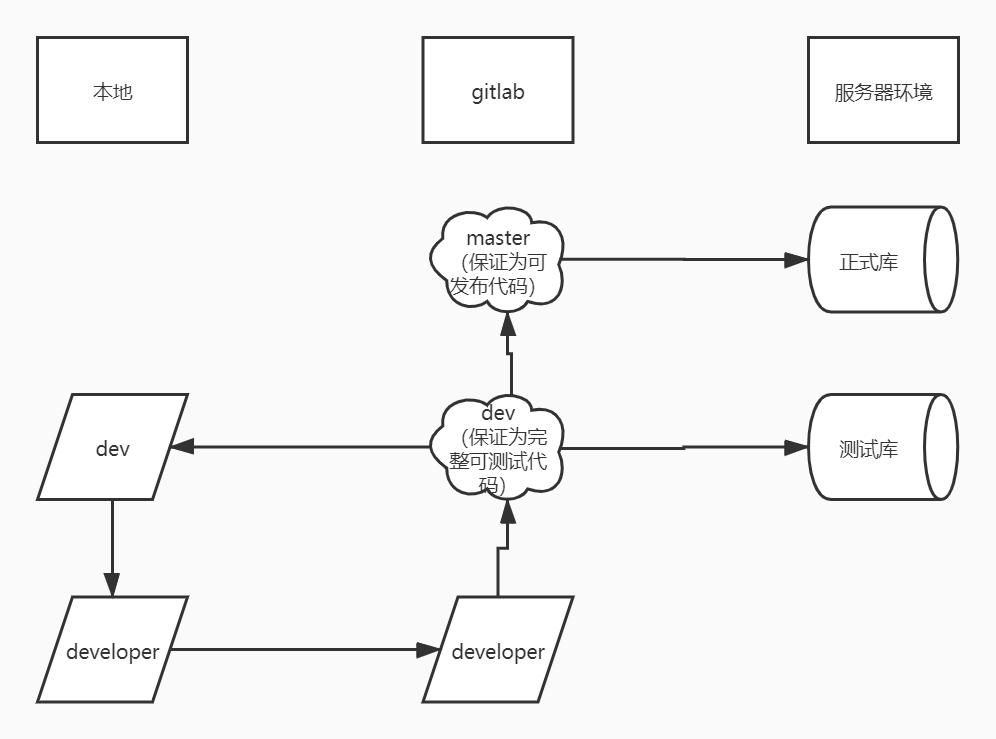

## 模块化

### 选用技术

[UMD:Webpack](https://webpack.toobug.net/zh-cn/chapter2/umd.html)

### 说明

使开发人员在开发过程中进行 `模块化开发` ，并可以模块间 `按需引入` ，减小代码体积

## 源码管理

### 选用技术

[GitLab](https://git.lug.ustc.edu.cn/users/sign_in)

### 说明

使用 `持续集成` 后，推荐将所有项目建立 `dev分支` ，专门用于开发。

不允许直接向 `master分支` 提交数据，并仅给予 `项目管理员` 合并 `master分支` 权限；

