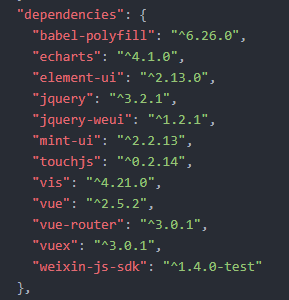
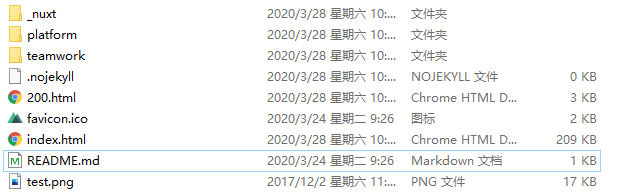
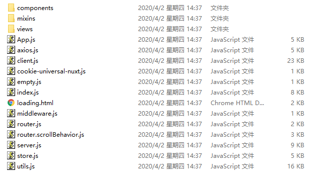

## 框架选型

### 选用技术

[vue](https://cn.vuejs.org/)

### 说明

渐进式 `MVVM` 框架，使用的技术包含但不限于 `vue、[vue-router](https://router.vuejs.org/zh-cn/)、[vuex](https://vuex.vuejs.org/zh/guide/)` 等；

## 依赖管理

### 选用技术

[npm](https://www.npmjs.com/)

### 说明

使项目能够使用 `npm install vue` 的形式进行包管理，并通过 `package.json` （下图所示）锁定 `开发时使用的库版本` ，保证不同开发人员的依赖一致；

## 脚手架

### 选用技术

[vue-cli](https://cli.vuejs.org/zh/guide/)

`配置修改版` [por-vue-cli](https://github.com/beiding110/por-vue-cli)

### 说明

配置修改版为根据本公司工作内容进行修改后的版本，相比原版，增加了 `jquery、sass、babel、公司组件库、公司方法库、sentry相关配置、cnzz相关配置` 等内容，开发人员可直接在项目内按照 `vue-cli` 规则进行开发；

最终成果为 `vue单页应用`，使用 `nginx` 反向代理后与后台交互运行;

### 选用技术

[nuxt](https://zh.nuxtjs.org/)

`配置修改版` [por-nuxt](https://github.com/beiding110/por-nuxt)

### 说明

配置修改版为根据本公司工作内容进行修改后的版本，相比原版，增加了 `axios配置、sass、公司组件库、公司方法库、sentry相关配置、cnzz相关配置` 等内容，开发人员可直接在项目内按照 `nuxt` 规则进行开发；

最终成果为 `vue多页应用`，使用 `nginx` 反向代理后与后台交互运行;

或 `vue ssr（服务端渲染）nodejs服务`，使用 `nodejs` 运行nodejs服务，并使用 `nginx` 反向代理后与后台交互运行;

