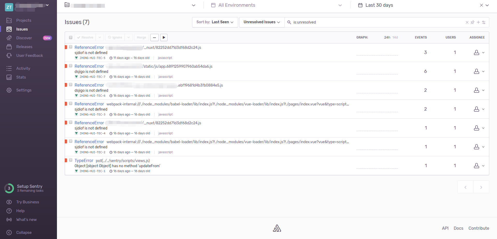
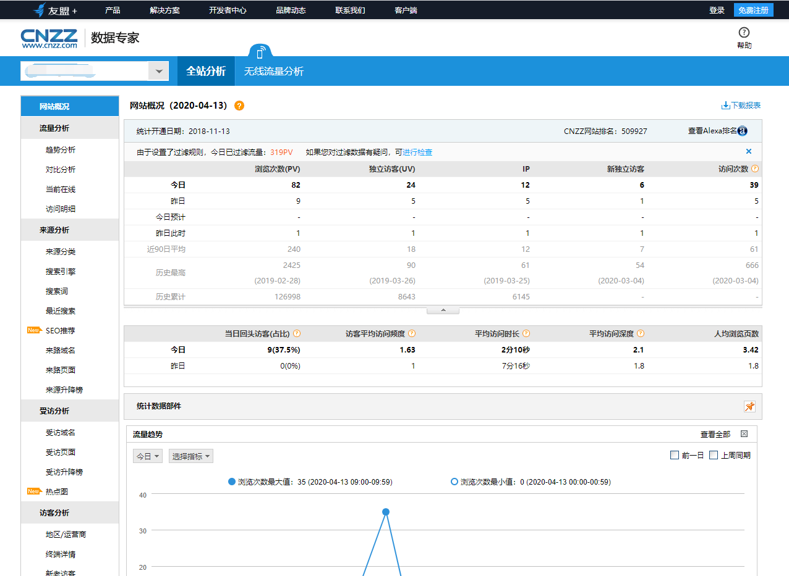

## 错误收集

### 选用技术

[Sentry](https://sentry.io/)

### 说明

通过在脚手架中进行配置，可以在Sentry系统中收集到报错的信息；

## 业务指标

### 选用技术

[CNZZ](https://doc.cnzz.com/about/product/cnzz_about.html)

### 说明

通过在脚手架中进行配置，可以在cnzz系统中收集信息；

